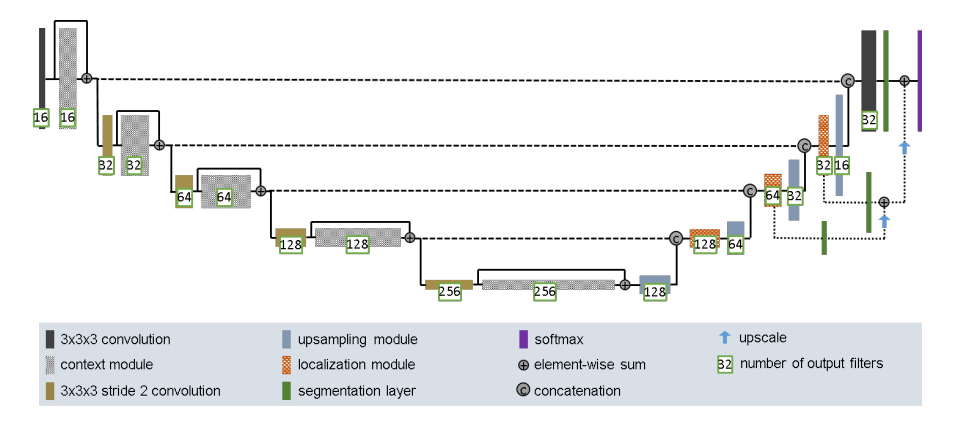
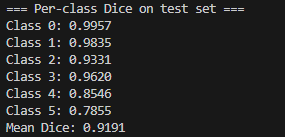
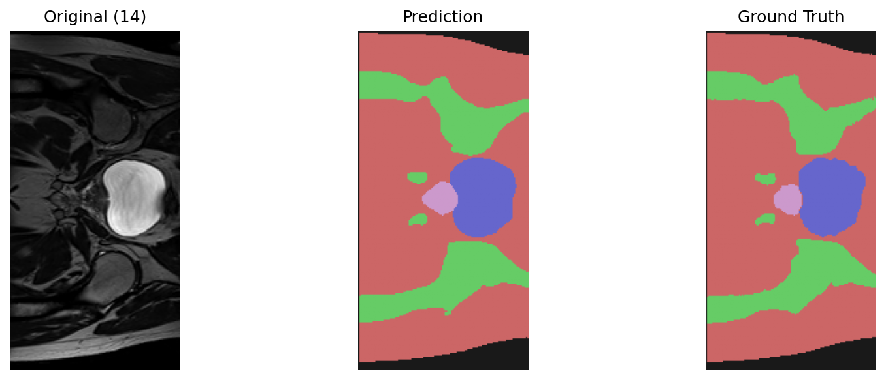
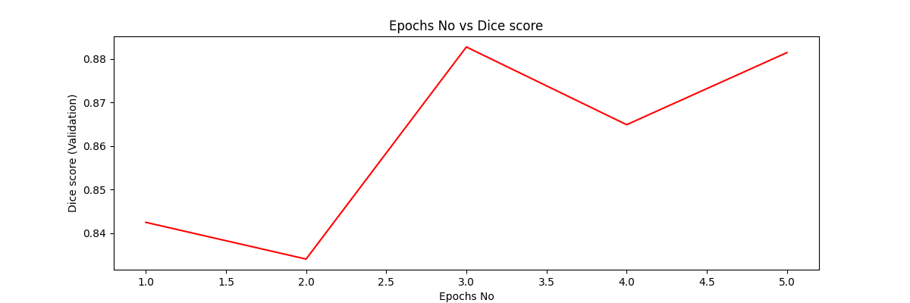
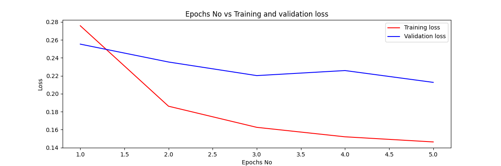
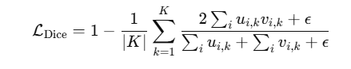
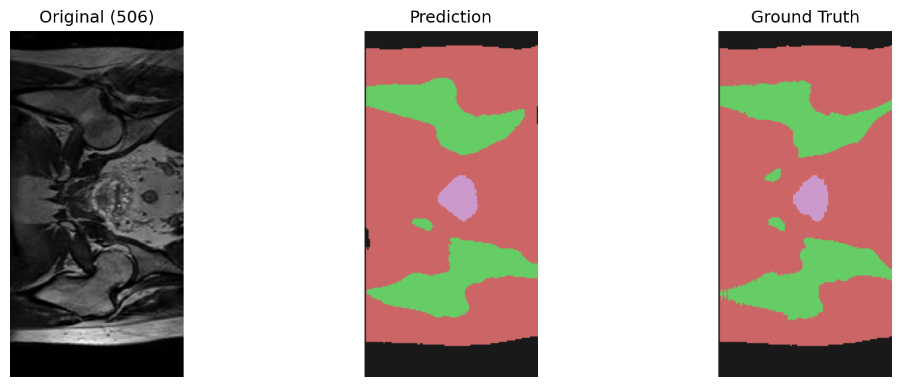
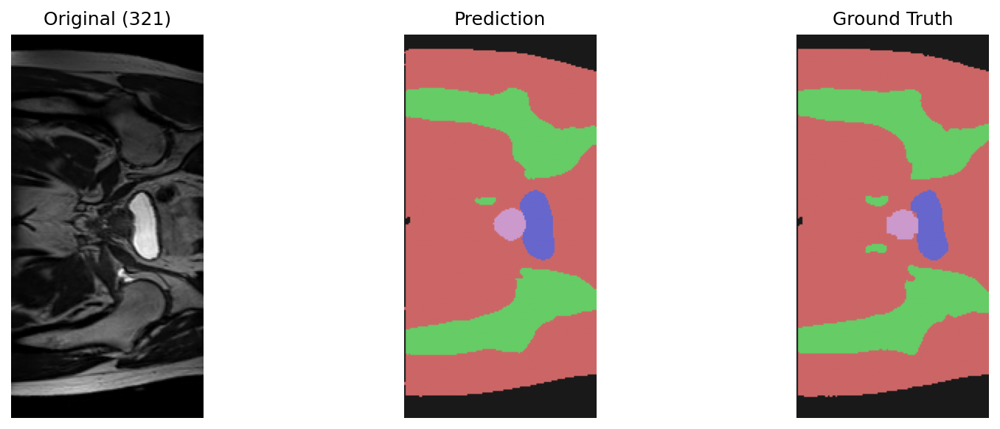
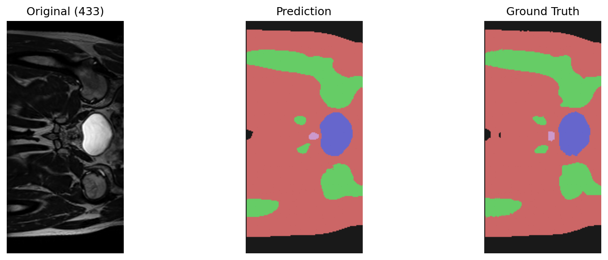

# HipMRI Improve2D UNET Image Segmentation
Name: Timothy Chen      
Email: timothy888chen@gmail.com  
Student ID: 48852489   
GPU used: NVIDIA GeForce GTX 1050 Ti

## Task
This project's aim is to accuretly segment processed 2D slices given by the HipMRI study on Prostate Cancer by using a improved 2D UNET. The minimum dice similiarity coefficient aiming at is 0.75 for all labels on the test set given. High accuracy 2D UNET is crucial for time saving in disease disgonosis and treatment planning by precisly delineates  organs, tissues and abnmormalitiese in medical image(Liu et al., 2023).

## Improved2D UNET Architecture
U-Net architeture is a convolutional neural network(CNN) use for image segmentatoin, including a encode and decoder, and specially the use of skip connection. However, it is prove to overfitting and sensitive to data quality.

This Improved2D UNET architecture is inspired by this improved3D UNET architecture(Isensee, Kickingereder, Wick, Bendszus, & Maier-Hein, 2018) as below:
 
This UNET architecture is used in performing a 3D segmentation in the original paper.
In this project, the aim is to improve 2D UNET in the similiar way based on how this 3D UNET is improved. This include the implmentation of the following: LeakyReLU, BatchNorm, different upsampling technique, Dropout, Loss function improved, deep supervision and dataset loading improvement.

### Context Pathway (Encoder):
Every downsampling stages uses pre-activation residula block rather than plain convolutional layers, Wwhere each block include two 3x3 convolutions and a dropout layer(p=0.3). This improve the gradient flow and overfitting.

### Localization Pathway(Decoder):
Using a simple upsampling with nearest neighbor, follwed by a 3x3 convlution instead of a transposed convolutions. Prevent the checkerboard artifiacts from transposed, giving better feature maps and reduce that artificat.

### Localization modules:
Normal skip connections link encoder and decoder layers at matching resolution, but the improved desgin use localization modules (3x3 and 1x1 convolutions) to concat encoder-decoder features efficiently and reduce memory usage.

### Deep Supervision:
Segmention outputs are also perform while at each step of upsampling, and their prediction are element-wise summed to form the final segmentation. This inject the gradient deeper into network, and also stabilizing training.

### Normalization and Nonlinearity:
Instance nomalization was used instead of batch normalization. And also LeakyReLU(0.01) is used instead of normal ReLu to prevent dead neuron. These changes give smoother gradient propagation into the network.

### Loss function
Loss function is also improved to using multiclass dice loss, which reduce the effect of the class size imbalance. The exact formula is discussed further down in this paper.

## Dataset
The datset used in this project have been acquired as part of the retrospective MRI-alone radiation therapy study from the Calvary Mater Newcastle Hospital(Dowling & Greer, 2021). Having 5 labels inlcuding 0-background, 1-body, 2-Bones, 3-Bladder, 4-Rectum, 5-Prostate. The goal of this project is to obtain the dice similiarity of above 0.75 on all 6 labels mentioned by using the segmentation of the Improved2D UNET.

The dataset have already been split into three section for both the original image and the labeled one for training, validating and testing purpose. This ensure the model doesn't mix the data up during the training process and the testing process.

Important aspect of the loading the dataset in this project, is that the image loaded is augmented to have a chance to be randomly horizontal or vertical fliped. This prevent the overfitting of the Improved2D UNET. 

The size of the train, validate, and test data set is as below:  
Train:11460  
Validate:660  
Test: 540  

## Dependencies
```
pytorch: 2.8.0+cu128
matplotlib: 3.10.1
numpy:  2.2.4
nibabel: 5.3.2
tqbm: 4.62.3
```
## Files
```
Module.py - Contain the improved2D Unet architechture and the dice loss function
Dataset.py - Contain the function for loading and preprocessing the data using nibabel 
Train.py - Contain the training process of the network, and saving the best one
Predict.py - Used for predicting and evaluating the model | Compare the prediction to the ground truth label 
```
## Reproducing Results
### Data Structure
The data structure should be the following, the naming should also be the same for subfolder(keras_slices_seg_test...), and ensure the order of the data should also be the same across original image and segmented.
```
> keras_slices_data
_> keras_slices_seg_test
___> seg_040_week_0_slice_0.nii.gz
___> .
___> .
___> .
_> keras_slices_seg_train
_> keras_slices_seg_validate
_> keras_slices_test
_> keras_slices_train
_> keras_slices_validate
```
### Training Model
For training model, there is mutiple parameter that can be changed, the following demonstrated what parameter you can chage.
```
python train.py
--data_root (necessary): The path to your data
--save_path (optional, default: "improved_unet2d.pt"): Where the Model saved to
--verbose (action = "store_true"): If ture, plot graph for epochs vs dice score and epochs vs loss 
--eval_all (action = "store_true"): If True, it calculate the average dice score of the model across all test image.
--epochs (optional, default: 50 ):number of epochs
--batch_size(optional, default:8) 
--lr(optional, default: 1e-3): learning rate for adam optimiser
--weight_decay(optional, default 1e-4)
--augment(action = "store_true"): If true, the loaded data go through data augmention, random horizontal and vertical flip.
```
eg.
```
python train.py --data_root ".\keras_slices_data" --augment --batch_size 2 --epochs 5 --eval_all
```
Then this train.py will run with augment = true, and eval_all = true :  
 

For the height, width and number of class is defaulted to set to this current data set.
If want to use this model for different size and number of label:
```
--height int
--width int
--num_class int
```

### Prediction 
To do Prediction using a trained model:
```
python predict.py
--data_root (necessary): The path to your data
--model_path (necessary): The path to your trained model
--case_root (optional, default: "1" ): The path to the image you want to segment.
--save_fig (optional, default: none): The path where you want to save your prediction image

```
If want to use differnt size and different number of class, use the same argument mentioed in Training Model.


#### Single case
```
python predict.py --data_root ".\keras_slices_data"  --model_path "improved_unet2d.pt" --case_root "Path to single case"
```
Single case is just any original case you want. eg( "seg_040_week_0_slice_0.nii.gz")  
The predict.py will automatically match the single case image to its corresponding segmentation and do comparsion, thus order of the data is important.
 


## Reproducibility of Result
The result of getting high Dice score is easily reproducible simply by training another model with similiar epochs and batch size. And the best model in each training is also saved. Loading the same model will give you the same segmentation for the same image.

## Analysis on the Training Model
The following output graph are obtained by:
```
python train.py --data_root ".\keras_slices_data" --batch_size 2 --epochs 5 --augment --verbose
```
 

 
The loss function in the module is defined as 0.5 * dice loss + 0.5 * cross_entropy_loss, the dice loss here is defined as:


The epilson presented in the formula is present to prevent the error of division of zero when the class dont exist in the image.
Cross entropy loss will help optimise per-pixel classification and dice loss will optimize region overlap (Isensee, Kickingereder, Wick, Bendszus, & Maier-Hein, 2018).]
## Sample Segmentation

 
  


## Reference

Dowling, et al. (2015), Automatic Substitute Computed Tomography Generation and Contouring for Magnetic Resonance Imaging (MRI)-Alone External Beam Radiation Therapy From Standard MRI Sequences, International Journal of Radiation Oncology*Biology*Physics, 93(5), pp. 1144-1153, https://doi.org/10.1016/j.ijrobp.2015.08.045 . 

Dowling, Jason; & Greer, Peter (2021): Labelled weekly MR images of the male pelvis. v2. CSIRO. Data Collection. https://doi.org/10.25919/45t8-p065


Liu, H., Hu, D., Li, H., & Oguz, I. (2023). Medical Image Segmentation Using Deep Learning. Neuromethods, 391–434. https://doi.org/10.1007/978-1-0716-3195-9_13

‌Isensee, F., Kickingereder, P., WIck, W., Bendszus, M., & Maier-Hein, K. (2018, February 28). Brain Tumor Segmentation and Radiomics Survival Prediction: Contribution to the BRATS 2017 Challenge. Retrieved from https://arxiv.org/abs/1802.10508v1: https://arxiv.org/abs/1802.10508v1